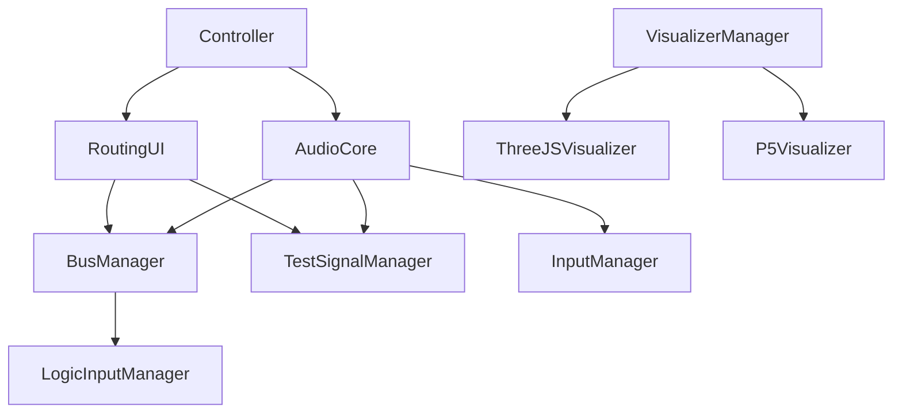

# Architecture Overview

**Acoustic Automaton Automatonic Assembly** - Audio-Visual Application Architecture

## System Overview

このプロジェクトは、Faust DSP、Web Audio API、Tauriを組み合わせたリアルタイム音響・視覚処理アプリケーションです。

## Core Architecture

### Audio Processing Layer
```
AudioContext (Web Audio API)
    ↓
Base Audio Layer (DSP非依存)
    ├── BusManager (ルーティング管理)
    ├── TestSignalManager (テスト信号生成)
    ├── InputManager (入力デバイス管理)
    └── OutputManager (出力制御)
    ↓
Faust DSP Layer (DSP処理)
    ├── FaustSynthController
    ├── FaustEffectController
    └── FaustWasmLoader
```

### UI/Controller Layer
```
Main Controller (controller.ts)
    ├── Audio Initialization Control
    ├── Device Management UI
    └── Parameter Control UI
    ↓
Routing UI (routingUI.ts)
    ├── Logic Input Controls
    ├── Test Signal Injection
    └── Monitor Controls
```

### Visualization Layer
```
Visualizer Manager
    ├── Three.js Visualizer (3D graphics)
    ├── p5.js Visualizer (creative coding)
    └── Multi-window Support
```

## Key Design Principles

### 1. Base Audio分離アーキテクチャ
- **目的**: DSP処理前でも基本的な音響機能を利用可能にする
- **実装**: `ensureBaseAudio()` → `applyFaustDSP()` の2段階初期化
- **利点**: テスト信号、デバイス管理、ルーティングがDSP非依存で動作

### 2. モジュラー設計
- 各機能を独立したモジュールとして実装
- 疎結合な設計による保守性とテスタビリティの向上
- グローバル状態の最小化

### 3. イベント駆動アーキテクチャ
- CustomEventによる疎結合な通信
- `'audio-base-ready'`, `'faust-dsp-applied'` などの状態通知
- リアクティブなUI更新

## Current Implementation Status

### ✅ 完了済み機能
- Base Audio Layer分離実装
- TestSignalManager統合
- RoutingUI TestSignalManager連携
- BusManager Logic Input管理
- Multi-window Visualizer Support

### 🚧 進行中機能
- ドキュメント整合性確保
- パフォーマンス最適化

### 🎯 計画中機能
- MIDI同期機能
- AudioWorklet移行
- レコーディング機能
- ライブエディット機能

## Module Dependencies



## File Organization

### Audio Module (`src/audio/`)
- `audioCore.ts` - Core audio initialization and management
- `busManager.ts` - Audio routing and bus management
- `testSignalManager.ts` - Test signal generation and control
- `inputManager.ts` - Input device management
- `dsp/` - Faust DSP related modules

### Controllers (`src/`)
- `controller.ts` - Main application controller
- `visualizer.ts` - Visualization controller

### UI Components (`src/audio/`)
- `routingUI.ts` - Audio routing interface
- `physicalDevicePanel.ts` - Device management interface

### Documentation (`docs/`)
- `ARCHITECTURE_OVERVIEW.md` - This file
- `AUDIO_SYSTEM.md` - Audio system detailed documentation
- `VISUALIZATION_SYSTEM.md` - Visualization system documentation
- `DEVELOPMENT_ROADMAP.md` - Future development plans
