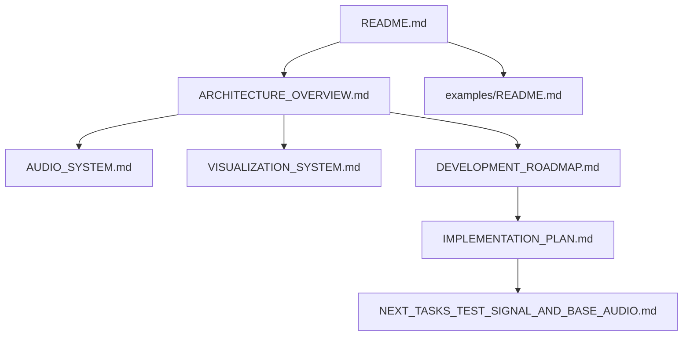

# Documentation Structure Overview

## Document Organization (2025-08-20)

This project's documentation has been restructured for better clarity and maintainability. Each document serves a specific purpose and target audience.

## 📋 Documentation Index

### 🏗️ Architecture & System Design
- **[ARCHITECTURE_OVERVIEW.md](./ARCHITECTURE_OVERVIEW.md)** - High-level system architecture and design principles
- **[WORK_ARCHITECTURE.md](./WORK_ARCHITECTURE.md)** - Work-centered architecture design and implementation plan
- **[AUDIO_SYSTEM.md](./AUDIO_SYSTEM.md)** - Detailed audio system documentation
- **[VISUALIZATION_SYSTEM.md](./VISUALIZATION_SYSTEM.md)** - Visualization system components and APIs

### 🛣️ Development Planning
- **[DEVELOPMENT_ROADMAP.md](./DEVELOPMENT_ROADMAP.md)** - Future development plans and priorities
- **[IMPLEMENTATION_PLAN.md](./IMPLEMENTATION_PLAN.md)** - Historical implementation logs and status
- **[NEXT_TASKS_TEST_SIGNAL_AND_BASE_AUDIO.md](./NEXT_TASKS_TEST_SIGNAL_AND_BASE_AUDIO.md)** - Phase 1-3 detailed implementation logs

### 📖 User Documentation
- **[../README.md](../README.md)** - Project overview, quick start, and basic usage
- **[../examples/README.md](../examples/README.md)** - Usage examples and tutorials

## 🎯 Target Audiences

### For Developers
- **New Contributors**: Start with `README.md` → `ARCHITECTURE_OVERVIEW.md`
- **Audio System Development**: Focus on `AUDIO_SYSTEM.md`
- **Visualization Development**: Focus on `VISUALIZATION_SYSTEM.md`
- **Planning & Roadmap**: Review `DEVELOPMENT_ROADMAP.md`

### For Project Managers
- **Status Overview**: `DEVELOPMENT_ROADMAP.md` → `IMPLEMENTATION_PLAN.md`
- **Feature Planning**: `DEVELOPMENT_ROADMAP.md`

### For End Users
- **Getting Started**: `README.md`
- **Examples**: `examples/README.md`

## 📊 Documentation Maintenance

### Consistency Guidelines
1. **Status Markers**: Use ✅ for completed, 🚧 for in-progress, 🎯 for planned
2. **Code Examples**: Include TypeScript/JavaScript examples where relevant
3. **Cross-References**: Link between related documents
4. **Date Stamps**: Include dates for major updates

### Update Responsibilities
- **ARCHITECTURE_OVERVIEW.md**: Update when system design changes
- **AUDIO_SYSTEM.md**: Update when audio components change
- **VISUALIZATION_SYSTEM.md**: Update when visualization features change
- **DEVELOPMENT_ROADMAP.md**: Update quarterly or when priorities change
- **README.md**: Update when core features or setup procedures change

### Review Schedule
- **Monthly**: Review all documentation for accuracy
- **Quarterly**: Major updates to roadmap and architecture docs
- **Release**: Update all relevant docs before major releases

## 🔄 Document Relationships

## 📝 Content Guidelines

### Technical Documentation
- **API References**: Include function signatures and examples
- **Architecture Diagrams**: Use Mermaid diagrams for visual clarity
- **Code Examples**: Provide working TypeScript/JavaScript code
- **Error Handling**: Document common issues and solutions

### Planning Documentation
- **Specific Goals**: Define measurable objectives
- **Priority Levels**: Use clear priority indicators (🔥 High, 🟡 Medium, 🔵 Low)
- **Timeline Estimates**: Include realistic time estimates
- **Success Criteria**: Define what "done" means for each feature

## 🚀 Future Documentation Plans

### Planned Additions
- **API_REFERENCE.md** - Comprehensive API documentation
- **TESTING_GUIDE.md** - Testing strategies and guidelines
- **DEPLOYMENT_GUIDE.md** - Production deployment instructions
- **TROUBLESHOOTING.md** - Common issues and solutions

### Enhancement Ideas
- **Interactive Documentation**: Consider GitBook or similar platform
- **Video Tutorials**: Screen recordings for complex procedures
- **Community Wiki**: Community-contributed documentation
- **Localization**: Multi-language documentation support

## ✅ Documentation Quality Checklist

Before updating any documentation:

- [ ] Content is accurate and up-to-date
- [ ] Cross-references are valid
- [ ] Code examples are tested and working
- [ ] Spelling and grammar are correct
- [ ] Formatting is consistent
- [ ] Target audience is clearly defined
- [ ] Related documents are updated if needed

## 📞 Contact and Contributions

For documentation improvements:
1. **Issues**: Report documentation problems via GitHub Issues
2. **Pull Requests**: Submit documentation improvements
3. **Discussions**: Use GitHub Discussions for documentation planning

### Documentation Style Guide
- **Tone**: Professional but approachable
- **Format**: Markdown with consistent heading hierarchy
- **Code**: Use syntax highlighting and proper indentation
- **Images**: Include alt text and clear captions
- **Links**: Use descriptive link text, avoid "click here"
